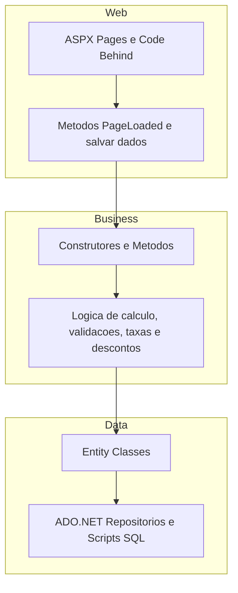

# Financeiro WebApp

Sistema web para **gerenciar lançamentos financeiros**, desenvolvido como desafio técnico para vaga de nível pleno.

Ele permite:

* Adicionar, editar e listar lançamentos financeiros
* Cancelar ou marcar pagamentos
* Calcular automaticamente valores com taxas ou descontos
* Visualizar o saldo total
* Exportar dados por mês em Excel

---

## Tecnologias

* **Front-end:** ASP.NET Web Forms
* **Back-end:** C# (Class Library)
* **Banco de dados:** SQL Server (ADO.NET)
* **Exportação Excel:** ClosedXML (via NuGet)

---

## Arquitetura

O projeto foi organizado em **três camadas** para manter o código limpo, organizado e facilitar manutenção futura:

1. **Data** – responsável pelo acesso ao banco de dados
2. **Business** – regras de negócio, validações e cálculos
3. **Web** – interface do usuário

Essa separação foi aplicada mesmo utilizando Web Forms, com o objetivo de evitar acoplamento entre interface, regras e persistência de dados.

---

## Decisões Técnicas

### Separação de Camadas

A divisão em Data, Business e Web foi adotada para:

* Isolar o acesso ao banco de dados
* Evitar regras de negócio no CodeBehind
* Facilitar manutenção e evolução do sistema
* Seguir boas práticas mesmo sem utilizar MVC ou ORM

Caso fosse necessário trocar o banco de dados ou evoluir regras de negócio, o impacto ficaria concentrado na camada correta.

---

### Exportação para Excel

A exportação foi implementada utilizando a biblioteca **ClosedXML**, instalada via NuGet:

```bash
Install-Package ClosedXML
```

A biblioteca foi escolhida porque:

* Não depende do Excel instalado na máquina
* Permite gerar arquivos `.xlsx` de forma simples
* É leve e prática para projetos Web Forms

---

### Por que o método de Excel está na Index?

O método de exportação foi criado dentro do arquivo `Index.aspx.cs` porque:

* O botão de exportação está na página principal
*Atualmente a exportação utiliza os dados exibidos na própria tela. Embora ainda não existam filtros implementados, a estrutura foi pensada para futuramente permitir filtros por mês, dia ou período específico, e a exportação já está preparada para acompanhar essa evolução.
* Não existe regra de negócio complexa na geração do arquivo

A responsabilidade ficou organizada da seguinte forma:

* A camada **Business** fornece os dados já tratados
* A página **Index** apenas gera e retorna o arquivo para download

Em um cenário maior, poderia ser criado um serviço específico de exportação dentro da camada Business.

---

#### Diagrama da Arquitetura


